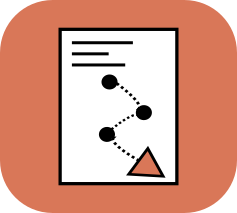

# Codraft

A document assembly tool built on Claude Cowork. Codraft replaces traditional document automation platforms (docassemble, HotDocs) by using Claude to interview users, collect field values, and produce completed documents from templates -- with support for conditional logic, repeating sections, and developer configuration.

## How It Works

1. Place your templates in `templates/`, each in its own subdirectory
2. Add `{{ variable_name }}` placeholders wherever you need dynamic content
3. Use `` / `` blocks for sections that should only appear based on user answers
4. Use `` blocks for repeating sections (e.g., line items, milestones)
5. Optionally add a `config.yaml` to customize questions, grouping, and validation
6. Ask Claude to "prepare a [document type]"
7. Claude walks you through a conversational interview -- skipping irrelevant sections and collecting lists naturally
8. A completed document is rendered and saved to a job folder in `output/`

Two template formats are supported:
- **`.docx`** -- rendered via `docxtpl`, produces a Word document
- **`.html`** -- rendered via `jinja2`, produces both an HTML file and a PDF (via `weasyprint`)

## Installation

### Prerequisites

You'll need a [Claude Cowork](https://claude.ai) account.

### Download Codraft

Go to the [Releases](https://github.com/houfu/codraft/releases) page and download the latest `codraft-v*.zip` file. Extract it to a folder of your choice (e.g., your Documents folder).

### Open in Cowork

1. Open Claude Cowork and add the extracted folder as a project
2. That's it -- Python dependencies are installed automatically the first time you use the skill

### Claude Code

From within Claude Code:

1. Add the marketplace: `/plugin marketplace add houfu/codraft`
2. Install the plugin: `/plugin install codraft@codraft`
3. Say "prepare an NDA" to try it out with a built-in template

## Quick Start

### 1. Add a template

Create a subdirectory in `templates/` and place your template file inside:

```
templates/
└── nda/
    └── nda.docx      <- contains {{ disclosing_party_name }}, {{ effective_date }}, etc.
```

Or for an HTML template:

```
templates/
└── invoice/
    └── invoice.html  <- same {{ variable }} syntax, styled with CSS
```

### 2. Prepare a document

Tell Claude:

> "I need to prepare an NDA"

Claude will find the template, extract its variables, and interview you for the values -- grouping related fields together for a natural flow.

### 3. Get your document

After confirming all values, the rendered document is saved to a job folder:

```
output/
└── nda_acme_pte_ltd_2026-02-15/
    └── nda_acme_pte_ltd_2026-02-15.docx
```

For HTML templates, both the HTML and PDF are saved:

```
output/
└── invoice_acme_2026-02-15/
    ├── invoice_acme_2026-02-15.html
    └── invoice_acme_2026-02-15.pdf
```

## v2 Features

### Conditional Logic

Templates can include or exclude sections based on user answers. The interview automatically skips questions that aren't relevant.

```

The Consultant hereby assigns all intellectual property
created during the engagement to {{ ip_ownership_entity }},
effective {{ ip_assignment_date }}.

```

Equality conditions are also supported:

```

Bank: {{ bank_name }}
Account: {{ account_number }}

Payment will be made via {{ payment_method }}.

```

### Loops

Templates can have repeating sections. The interview collects items one at a time with an "add another?" flow.

```

Milestone: {{ milestone.description }}
Due Date: {{ milestone.date }}
Amount: {{ milestone.amount }}

```

### Developer Configuration (config.yaml)

Template developers can place an optional `config.yaml` alongside their template to customize the interview experience:

```yaml
meta:
  display_name: "Consulting Agreement"
  description: "Standard consulting engagement agreement"

variables:
  client_name:
    label: "Client's Legal Name"
    question: "What is the client's full legal name?"
    required: true
  payment_method:
    type: choice
    choices: [bank_transfer, cheque, crypto]
    default: "bank_transfer"
  include_ip_assignment:
    type: boolean
    default: false

groups:
  - name: "Parties"
    variables: [client_name, client_address]
  - name: "IP Assignment"
    condition: include_ip_assignment
    variables: [ip_ownership_entity, ip_assignment_date]
  - name: "Milestones"
    loop: milestones
    variables: [description, date, amount]

validation:
  - rule: "end_date > effective_date"
    message: "The end date must be after the effective date"
```

Config features include:
- **Custom questions and labels** for each variable
- **Variable types**: `text`, `date`, `number`, `email`, `phone`, `boolean`, `choice`
- **Interview groups** to control question ordering and grouping
- **Conditional groups** that only appear based on gate variable answers
- **Loop groups** for collecting lists
- **Default values** (including `"today"` for dates)
- **Validation rules** evaluated during confirmation

### Skill Separation

v2 splits the monolithic skill into three focused skills:

| Skill | Purpose |
|---|---|
| **Orchestrator** | Entry point. Discovery, interview, confirmation, post-render. |
| **Analyzer** | Template parsing, variable extraction, manifest generation. |
| **Renderer** | Docx/HTML rendering, output validation. |

## Template Authoring

### Placeholders

Use Jinja2-style double-brace syntax in both `.docx` and `.html` templates:

```
This Agreement is entered into by {{ disclosing_party_name }}
(the "Disclosing Party") with address at {{ disclosing_party_address }}.
```

### Conditional Sections

Use `` / `` / `` to include or exclude sections:

```

The Seller warrants that the goods are free from defects.

The goods are sold "as is" without warranty.

```

Two condition forms are supported:
- **Truthiness:** `` -- variable is truthy (boolean true, non-empty)
- **Equality:** `` -- variable equals a specific string

### Loop Sections

Use `` / `` for repeating sections:

```

Service: {{ service.description }}
Fee: {{ service.fee }}

```

Inside the loop body, reference sub-variables with dot notation: `{{ loop_var.sub_variable }}`.

### Variable Naming Conventions

Name your variables with descriptive suffixes for automatic type inference:

| Suffix | Inferred type | Example |
|--------|--------------|---------|
| `*_name` | text | `landlord_name` |
| `*_address` | text | `property_address` |
| `*_date` | date | `commencement_date` |
| `*_email` | email | `tenant_email` |
| `*_amount`, `*_price`, `*_fee` | number | `rental_amount` |
| `*_phone`, `*_tel`, `*_mobile` | phone | `contact_phone` |
| (other) | text | `governing_law` |

### Rules

- One template file per directory (`.docx` or `.html`, not both)
- Use `{{ }}` with spaces around the variable name: `{{ name }}` not `{{name}}`
- Variable names must be valid Python identifiers: lowercase, underscores, no spaces
- The same variable can appear multiple times in the document -- it will be filled with one value
- Single-level nesting only: no `` inside ``, or vice versa
- `` is not supported (use separate `` blocks instead)

## Project Structure

```
codraft/
├── CLAUDE.md                         # Project instructions for Claude
├── README.md                         # This file
├── LICENSE                           # MIT License
├── .gitignore
├── .claude/
│   └── skills/
│       ├── codraft/
│       │   └── SKILL.md              # Orchestrator skill (entry point)
│       ├── codraft-analyzer/
│       │   └── SKILL.md              # Analyzer skill (template parsing)
│       └── codraft-renderer/
│           └── SKILL.md              # Renderer skill (document output)
├── docs/
│   ├── codraft_mvp_spec.md           # Original MVP specification
│   └── codraft_v2_spec.md            # Full v2 specification
├── templates/
│   ├── _examples/                    # Bundled example templates (tracked in git)
│   │   ├── Bonterms_Mutual_NDA/
│   │   │   └── Bonterms-Mutual-NDA.docx
│   │   ├── invoice/
│   │   │   └── invoice.html
│   │   ├── consulting_agreement/     # v2 example (conditionals + loops)
│   │   │   ├── Consulting-Agreement.docx
│   │   │   └── config.yaml
│   │   └── event_invitation/         # v2 example (conditionals + loops)
│   │       ├── event-invitation.html
│   │       └── config.yaml
│   └── <your_template>/              # Your templates (gitignored)
│       ├── <name>.docx or .html
│       ├── manifest.yaml             # Auto-generated (do not edit)
│       └── config.yaml               # Optional developer config
└── output/                           # Rendered documents (gitignored)
    └── <job_name>/                   # One folder per rendering job
```

## Technical Details

- **Template engines:** `docxtpl` for docx (preserves formatting), `jinja2` + `weasyprint` for HTML to PDF
- **Python environment:** managed with `uv`
- **Manifest caching:** variable analysis is cached in `manifest.yaml` per template and only regenerated when the template file changes
- **Manifest v2 schema:** includes `schema_version: 2`, conditionals, loops, dependencies, and optional groups/validation

## Current Scope (v2)

Codraft v2 supports variable substitution, conditional logic (`` / ``), loops (``), and developer configuration via `config.yaml`. See `docs/codraft_v2_spec.md` for the full specification and `docs/codraft_mvp_spec.md` for the original MVP specification.

**v2 constraints:** single-level nesting only, two condition forms (truthiness and equality), no ``, no computed fields or expressions.

## License

MIT -- see [LICENSE](LICENSE).
