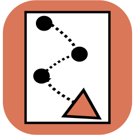

# Codraft

Codraft is a document assembly tool for people already working with Claude and AI. If you're comfortable chatting with Claude, there's nothing new to learn — just ask it to prepare a document with Codraft. Claude interviews you conversationally, collects the answers, and renders completed documents from your templates. No server, no database, no scripting language to learn. The whole project is a folder you can share as a zip — or deploy as a Claude Code plugin across your organisation in minutes.

## How It Works

1. Place your templates in `templates/`, each in its own subdirectory
2. Add `{{ variable_name }}` placeholders wherever you need dynamic content
3. Use `` / `` blocks for sections that should only appear based on user answers
4. Use `` blocks for repeating sections (e.g., line items, milestones)
5. Optionally add a `config.yaml` to customize questions, grouping, and validation
6. Ask Claude to "prepare a [document type] with Codraft"
7. Claude walks you through a conversational interview -- skipping irrelevant sections and collecting lists naturally
8. A completed document is rendered and saved to a job folder in `output/`

Two template formats are supported:
- **`.docx`** -- rendered via `docxtpl`, produces a Word document
- **`.html`** -- rendered via `jinja2`, produces both an HTML file and a PDF (via `weasyprint`)

## Installation

### Prerequisites

You'll need a [Claude Cowork](https://claude.ai) account.

### Download Codraft

Go to the [Releases](https://github.com/houfu/codraft/releases) page and download the latest `codraft-v*.zip` file. Extract it to a folder of your choice (e.g., your Documents folder).

### Open in Cowork

1. Open Claude Cowork and add the extracted folder as a project
2. That's it — no terminal or coding knowledge required. Python dependencies are installed automatically the first time you use the skill.

### Claude Code

From within Claude Code:

1. Add the marketplace: `/plugin marketplace add houfu/codraft`
2. Install the plugin: `/plugin install codraft@codraft`
3. Say "prepare an NDA with Codraft" to try it out with a built-in template

## Quick Start

### 1. Add a template

Create a subdirectory in `templates/` and place your template file inside:

```
templates/
└── nda/
    └── nda.docx      <- contains {{ disclosing_party_name }}, {{ effective_date }}, etc.
```

Or for an HTML template:

```
templates/
└── invoice/
    └── invoice.html  <- same {{ variable }} syntax, styled with CSS
```

### 2. Prepare a document

Tell Claude:

> "I need to prepare an NDA with Codraft"

Claude will find the template, extract its variables, and interview you for the values -- grouping related fields together for a natural flow.

### 3. Get your document

After confirming all values, the rendered document is saved to a job folder:

```
output/
└── nda_acme_pte_ltd_2026-02-15/
    └── nda_acme_pte_ltd_2026-02-15.docx
```

For HTML templates, both the HTML and PDF are saved:

```
output/
└── invoice_acme_2026-02-15/
    ├── invoice_acme_2026-02-15.html
    └── invoice_acme_2026-02-15.pdf
```

## v2 Features

### Conditional Logic

Templates can include or exclude sections based on user answers. The interview automatically skips questions that aren't relevant.

```

## Decisions
{{ decisions }}

```

Equality conditions are also supported:

```

### Workshop Materials
{{ workshop_materials }}

```

### Loops

Templates can have repeating sections. The interview collects items one at a time with an "add another?" flow.

```

- **{{ item.description }}** — Assigned to: {{ item.assignee }}, Due: {{ item.due_date }}

```

### Developer Configuration (config.yaml)

Template developers can place an optional `config.yaml` alongside their template to customize the interview experience:

```yaml
meta:
  display_name: "Meeting Notes"
  description: "Structured meeting notes with action items and optional sections"

variables:
  meeting_title:
    label: "Meeting Title"
    question: "What is the title of this meeting?"
    required: true
  meeting_type:
    type: choice
    choices: [standup, workshop, review]
    default: "standup"
  decisions_made:
    type: boolean
    question: "Were any decisions made during this meeting?"
    default: false

groups:
  - name: "Meeting Details"
    variables: [meeting_title, meeting_date, meeting_type, facilitator_name]
  - name: "Workshop Materials"
    condition: "meeting_type == 'workshop'"
    variables: [workshop_materials]
  - name: "Action Items"
    loop: action_items
    variables: [description, assignee, due_date]

validation:
  - rule: "next_meeting_date > meeting_date"
    message: "The next meeting date must be after this meeting's date"
```

Config features include:
- **Custom questions and labels** for each variable
- **Variable types**: `text`, `date`, `number`, `email`, `phone`, `boolean`, `choice`
- **Interview groups** to control question ordering and grouping
- **Conditional groups** that only appear based on gate variable answers
- **Loop groups** for collecting lists
- **Default values** (including `"today"` for dates)
- **Validation rules** evaluated during confirmation

### Skill Separation

v2 splits the monolithic skill into three focused skills:

| Skill | Purpose |
|---|---|
| **Orchestrator** | Entry point. Discovery, interview, confirmation, post-render. |
| **Analyzer** | Template parsing, variable extraction, manifest generation. |
| **Renderer** | Docx/HTML rendering, output validation. |

## Template Authoring

### Placeholders

Use Jinja2-style double-brace syntax in both `.docx` and `.html` templates:

```
This Agreement is entered into by {{ disclosing_party_name }}
(the "Disclosing Party") with address at {{ disclosing_party_address }}.
```

### Conditional Sections

Use `` / `` / `` to include or exclude sections:

```

The Seller warrants that the goods are free from defects.

The goods are sold "as is" without warranty.

```

Two condition forms are supported:
- **Truthiness:** `` -- variable is truthy (boolean true, non-empty)
- **Equality:** `` -- variable equals a specific string

### Loop Sections

Use `` / `` for repeating sections:

```

- {{ item.description }} — Assigned to: {{ item.assignee }}, Due: {{ item.due_date }}

```

Inside the loop body, reference sub-variables with dot notation: `{{ loop_var.sub_variable }}`.

### Variable Naming Conventions

Name your variables with descriptive suffixes for automatic type inference:

| Suffix | Inferred type | Example |
|--------|--------------|---------|
| `*_name` | text | `landlord_name` |
| `*_address` | text | `property_address` |
| `*_date` | date | `commencement_date` |
| `*_email` | email | `tenant_email` |
| `*_amount`, `*_price`, `*_fee` | number | `rental_amount` |
| `*_phone`, `*_tel`, `*_mobile` | phone | `contact_phone` |
| (other) | text | `governing_law` |

### Rules

- One template file per directory (`.docx` or `.html`, not both)
- Use `{{ }}` with spaces around the variable name: `{{ name }}` not `{{name}}`
- Variable names must be valid Python identifiers: lowercase, underscores, no spaces
- The same variable can appear multiple times in the document -- it will be filled with one value
- Single-level nesting only: no `` inside ``, or vice versa
- `` is not supported (use separate `` blocks instead)

## Project Structure

```
codraft/
├── CLAUDE.md                         # Project instructions for Claude
├── README.md                         # This file
├── LICENSE                           # MIT License
├── .gitignore
├── .claude/
│   └── skills/
│       ├── codraft/
│       │   └── SKILL.md              # Orchestrator skill (entry point)
│       ├── codraft-analyzer/
│       │   └── SKILL.md              # Analyzer skill (template parsing)
│       └── codraft-renderer/
│           └── SKILL.md              # Renderer skill (document output)
├── docs/
│   ├── codraft_mvp_spec.md           # Original MVP specification
│   └── codraft_v2_spec.md            # Full v2 specification
├── templates/
│   ├── _examples/                    # Bundled example templates (tracked in git)
│   │   ├── Bonterms_Mutual_NDA/
│   │   │   └── Bonterms-Mutual-NDA.docx
│   │   ├── invoice/
│   │   │   └── invoice.html
│   │   └── meeting_notes/            # v2 example (conditionals + loops + config)
│   │       ├── meeting_notes.md
│   │       └── config.yaml
│   └── <your_template>/              # Your templates (gitignored)
│       ├── <name>.docx or .html
│       ├── manifest.yaml             # Auto-generated (do not edit)
│       └── config.yaml               # Optional developer config
└── output/                           # Rendered documents (gitignored)
    └── <job_name>/                   # One folder per rendering job
```

## Technical Details

- **Template engines:** `docxtpl` for docx (preserves formatting), `jinja2` + `weasyprint` for HTML to PDF
- **Python environment:** managed with `uv`
- **Manifest caching:** variable analysis is cached in `manifest.yaml` per template and only regenerated when the template file changes
- **Manifest v2 schema:** includes `schema_version: 2`, conditionals, loops, dependencies, and optional groups/validation

## Current Scope (v2)

Codraft v2 supports variable substitution, conditional logic (`` / ``), loops (``), and developer configuration via `config.yaml`. See `docs/codraft_v2_spec.md` for the full specification and `docs/codraft_mvp_spec.md` for the original MVP specification.

**v2 constraints:** single-level nesting only, two condition forms (truthiness and equality), no ``, no computed fields or expressions.

## Limitations

Codraft trades determinism for conversational flexibility. A few things to keep in mind:

- **No fixed interview order** — Claude manages the conversation, not a scripted sequence
- **Prompt injection** — a user can influence the document by saying "also add a clause that…" during the interview
- **AI suggestions need review** — Claude may suggest plausible but wrong values (e.g., a made-up address)
- **Not legal advice** — documents still need review by a qualified professional
- **Single-level template nesting only** — no blocks inside other blocks (v2 constraint)
- **Requires Claude Cowork or Claude Code** — no web or mobile interface

See the [Limitations page](https://houfu.github.io/codraft/feature-tour/limitations/) in the docs for the full picture.

## License

MIT -- see [LICENSE](LICENSE).
